# Analyzing Success Factors in Elden Ring Nightreign

## DSA 210 Fall 2025-2026 Term Project

**Student:** Mina Altundiş  

---

## Table of Contents
- [Motivation](#motivation)
- [Research Framework](#research-framework)
- [Dataset](#dataset)
- [Data Collection](#data-collection)
- [Analysis Methodology](#analysis-methodology)
- [Key Findings](#key-findings)
- [Project Structure](#project-structure)

---

## Motivation

Elden Ring Nightreign is a roguelike action RPG where players complete multiple runs per gaming session, with each run resetting upon completion. As an active player, I've observed that my performance varies significantly across different runs, characters, and strategic decisions. However, it's unclear which factors most strongly influence success.

This project aims to **identify and quantify the key factors that lead to successful runs** in Nightreign, providing data-driven insights for gameplay optimization. Understanding these patterns has practical value for improving my own performance and could reveal interesting behavioral patterns in roguelike gaming.

### Game Context

To understand the dataset, here are the key game mechanics:

- **Run Structure:** Each expedition lasts 3 in-game days. Players explore during the day, fight bosses at night, and face a final "Nightlord" boss on day 3. Success means defeating the Nightlord; failure can occur on any day.

- **Nightfarers (Characters):** Players choose from 8 unique characters, each with different abilities. Examples: Recluse (magic user), Revenant (summoner), Wylder (all-rounder), Guardian (tank).

- **Evergaols (0-7):** Optional mini-dungeons providing combat buffs. High time investment, defensive benefits.

- **Great Enemies:** Elite enemies dropping valuable loot. Moderate time cost, offensive benefits.

- **Middle Castle:** Central landmark with premium upgrades. Highest time cost, strongest rewards.

- **Nightlords:** Eight powerful bosses that serve as the final challenge. Each has unique mechanics and weaknesses that need to be accomodated for (e.g., Gladius, Caligo, Fulghor).
- **Enhanced versions** available with increased difficulty

- **Game Difficulties:** 
  - *Deep of Night: Depth (1-5):* Progressively harder difficulty tiers with ranking systems

- **Runes:** In-game currency earned by defeating enemies, used to level up the character (max level 15 per run).

- **Team Composition:** Players can tackle runs solo, in duos, or trios, either with friends or random matchmaking.
- ### Data Overview


Here's what my gameplay data looks like:


<div align="center">

  

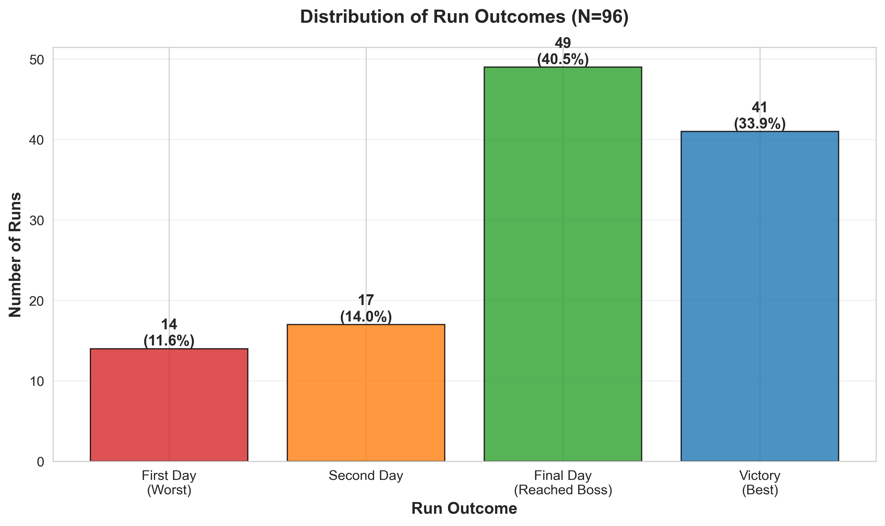

*Figure 1: Distribution of run outcomes showing progression through game stages*


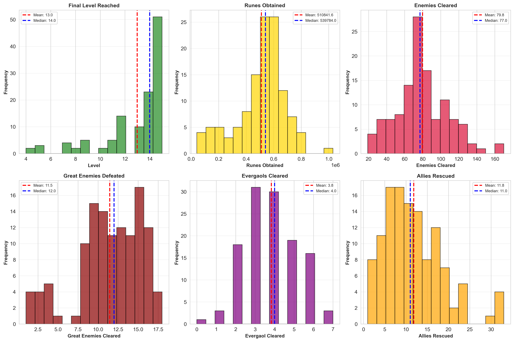

*Figure 2: Key performance metrics across all runs*


</div>
---

## Research Framework


### Primary Research Question

**How can I optimize resource allocation under time constraints to maximize progression in Elden Ring Nightreign?**


This project transforms traditional gaming performance analysis into a strategic optimization problem, examining:


### Specific Research Questions


1. **Session Progression Effects (Warm-up & Fatigue)**

   - Does performance improve after initial runs (warm-up effect)?

   - Does performance decline in extended sessions (fatigue effect)?

   - What is the optimal session length?


2. **Optimal Evergaol Strategy**

   - Is there a "sweet spot" for evergaol clearing, or is more always better?

   - Do diminishing returns exist beyond a certain threshold?

   - What's the optimal balance between buff acquisition and time management?


3. **Resource Allocation Trade-offs**

   - What's the optimal distribution between evergaols, great enemies, and middle castle?

   - Which strategies consistently lead to higher progression?

   - How do resource allocation strategies compare in win rate and progression?


4. **Strategy Adaptation by Team Size**

   - Does optimal strategy differ between duo and trio compositions?

   - Can trios leverage splitting up to pursue aggressive strategies?

   - Should duos be more conservative due to coordination constraints?


5. **Character Performance Analysis**

   - Which character yields the best performance for my playstyle?

   - Does character choice significantly impact outcomes?

   - Do certain characters synergize better with specific strategies?


6. **Difficulty Progression Validation**

   - Does performance decline as expected with increasing difficulty?

   - Are difficulty tiers properly calibrated?

   - How does enhanced nightlord difficulty compare to standard versions?


7. **Skill vs Luck Decomposition**

   - What percentage of performance variance is due to controllable factors (strategy, decisions)?

   - What percentage is due to RNG factors (map, nightlord, enhanced status)?

   - Can we quantify the impact of player skill versus random chance?
---

## Dataset

### Overview
- **Source:** Personal gameplay data from Elden Ring Nightreign (FromSoftware, 2025)
- **Collection Period:** September 2025 - Present
- **Current Size:** 121 completed runs
- **Target Size:** 200+ runs by project completion
- **Variables:** 17 base variables + 16 engineered features

### Variables

| Variable | Type | Description |
|----------|------|-------------|
| `run_id` | Numeric | Unique identifier for each run |
| `run_index_in_day` | Numeric | Position of run within gaming session |
| `character` | Categorical | Character played (recluse, revenant, wylder, guardian) |
| `difficulty` | Ordinal | Difficulty level (ordered: depth1 < depth2 < depth3 < depth4 < depth5) |
| `nightlord` | Categorical | Boss faced (Gladius, Caligo, Adel, Fulghor, Gnoster, Heolstor, Libra, Maris) |
|`enhanced` | Boolean | Whether the Nightlord is enhanced version |
| `map` | Categorical | Map variant (base, crater, rotted_woods, mountaintop, noklateo) |
| `run_outcome` | Ordinal | Result (ordered by progression: first_day < second_day < final_day < victory) |
| `evergaol_cleared` | Numeric | Number of optional challenges completed (0-7) |
| `middle_castle_visited` | Boolean | Whether player visited middle castle |
| `great_enemies_cleared` | Numeric | Number of great-enemies defeated |
| `enemies_cleared` | Numeric | Number of normal enemies defeated |
| `team_type` | Categorical | Solo, duo, or trio |
| `allies_rescued` | Numeric | Number of times teammates were revived |
| `runes_obtained` | Numeric | In-game currency earned |
| `level` | Numeric | Final character level reached (1-15) |

### Engineered Features


Created 16 additional features for enhanced analysis:


**Ordinal Conversions:**

- `run_outcome_ordinal` (0-3): Numeric progression scale

- `difficulty_ordinal` (1-5): Numeric difficulty scale


**Binary Indicators:**

- `victory_binary`: Success indicator (1 = victory, 0 = defeat)

- `final_day_reached`: Whether reached final boss

- `middle_castle_visited` (already boolean)


**Strategic Categories:**

- `evergaol_category`: Low (0-2), Medium (3-4), High (5-7)

- `strategy_type`: buff_focused, loot_focused, high_risk_castle, speedrun


**Performance Metrics:**

- `victory_binary`, `efficiency_ratio`, `runes_per_level`, `rescue_rate`

- `team_strategy_combo`, `total_content_cleared`, `resource_intensity`

---

## Data Collection

### Collection Method
Data is collected **manually after each gaming session** using a structured Google Sheets template.

### Process
1. **During gameplay:** Focus on performance without interruption

2. **Post-run:** Record metrics from in-game log system

3. **Session end:** Review and validate entries for consistency

4. **Weekly:** Export to CSV for analysis

---

## Analysis Methodology

### 1. Data Preprocessing
- **Ordinal conversions:** Map categorical outcomes to numeric scales
- **Feature engineering:** Create 16 strategic and performance features
- **Data validation:** Handle missing values, check for duplicates
- **Quality checks:** Ensure consistency across all variables

### 2. Exploratory Data Analysis (EDA)

Comprehensive visualization suite examining distributions, relationships, and strategic patterns:


<div align="center">


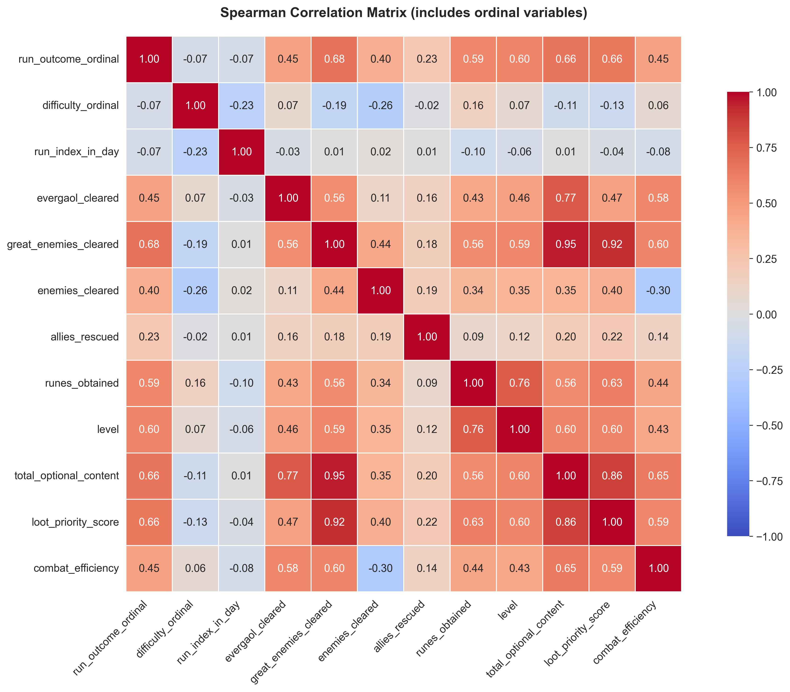

*Figure 6: Correlation matrix revealing relationships between key variables*


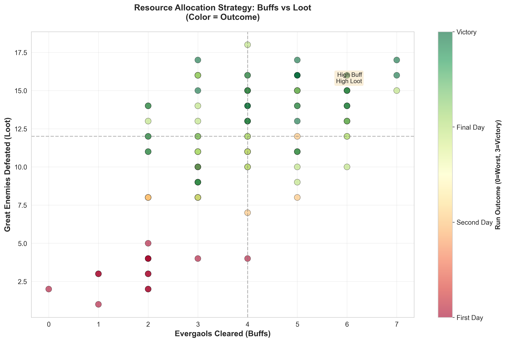

*Figure 7: Strategic resource allocation patterns*


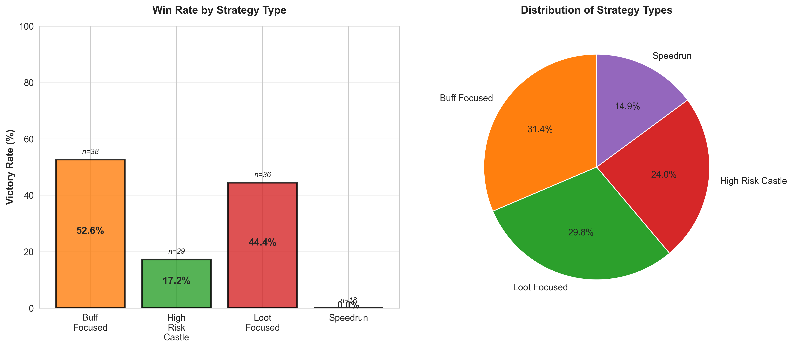

*Figure 8: Performance comparison across resource allocation strategies*


</div>

### 3. Hypothesis Testing (7 Tests)

**Test 1: Session Progression Effects**
- Methods: Mann-Whitney U (warm-up & fatigue), Spearman correlation, Kruskal-Wallis
- Compares: First vs later runs, early vs late runs, overall session trend
- Goal: Identify optimal session length and warm-up requirements

**Test 2: Optimal Evergaol Strategy**
- Methods: Kruskal-Wallis H-test, Polynomial regression
- Compares: Low (0-2), Medium (3-4), High (5-7) evergaol strategies
- Goal: Find sweet spot and test for diminishing returns

**Test 3: Resource Allocation Trade-offs**
- Methods: Kruskal-Wallis H-test, Post-hoc Mann-Whitney U with Bonferroni correction
- Compares: buff_focused, loot_focused, high_risk_castle, speedrun strategies
- Goal: Identify optimal resource allocation pattern

**Test 4: Strategy × Team Size Interaction**
- Methods: Two-way Kruskal-Wallis, Stratified analysis
- Compares: Optimal strategies for duo vs trio teams
- Goal: Determine if team size requires strategy adaptation

**Test 5: Character Performance**
- Methods: Kruskal-Wallis H-test, Effect size analysis
- Compares: Performance across all playable characters
- Goal: Identify best-performing character for playstyle

**Test 6: Difficulty Progression Validation**
- Methods: Spearman correlation, Kruskal-Wallis across difficulty tiers
- Compares: Performance across depth1-5 difficulties
- Goal: Validate difficulty scaling and progression

**Test 7: Skill vs Luck Decomposition**
- Methods: Variance decomposition, R² comparison
- Compares: Controllable factors vs RNG factors
- Goal: Quantify player agency in performance outcomes

### Statistical Standards
- **Significance level:** α = 0.05
- **Effect sizes:** Cohen's d for magnitude interpretation
- **Corrections:** Bonferroni for multiple comparisons
- **Visualization:** Publication-quality figures for all tests

---

## Key Findings

### 🎯 Main Results

#### **1. Resource Allocation Optimization**

<div align="center">

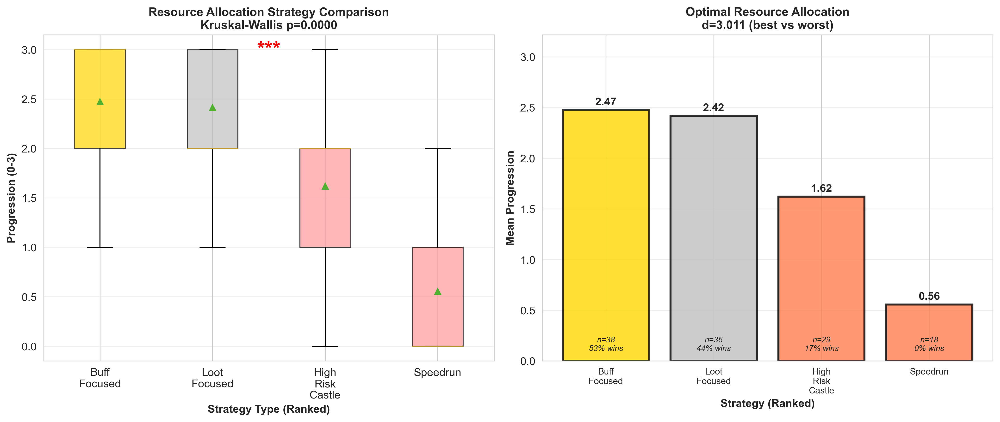
*Figure 9: Optimal resource allocation strategy comparison*

</div>

- **Optimal strategy:** Buff-focused (clearing 5-7 evergaols)
- **Performance:** 2.47 mean progression vs 0.56 for speedrun
- **Key insight:** Investing in buffs yields 4.4× better progression than rushing

**Supporting Evidence:**

<div align="center">

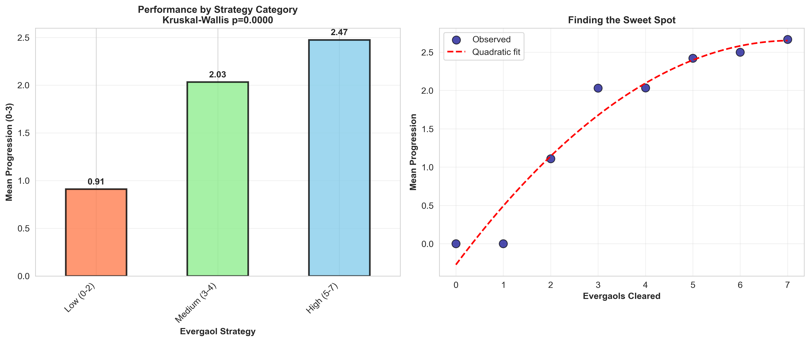
*Figure 10: Sweet spot analysis for evergaol clearing*

</div>

---

#### **2. Team Size Matters**

<div align="center">

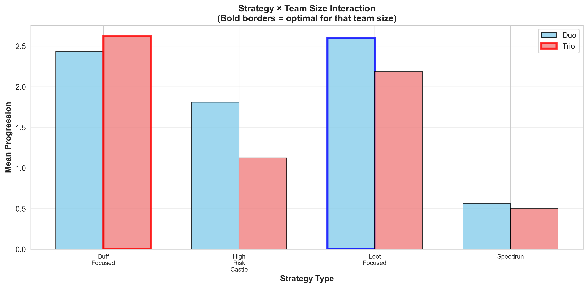
*Figure 11: Strategy effectiveness varies by team composition*

</div>

- **Duo optimal:** Loot-focused strategy
- **Trio optimal:** Buff-focused strategy (can split up efficiently)
- **Strategic implication:** Team composition requires tactical adaptation

---

#### **3. No Warm-up or Fatigue Effects Detected**

<div align="center">

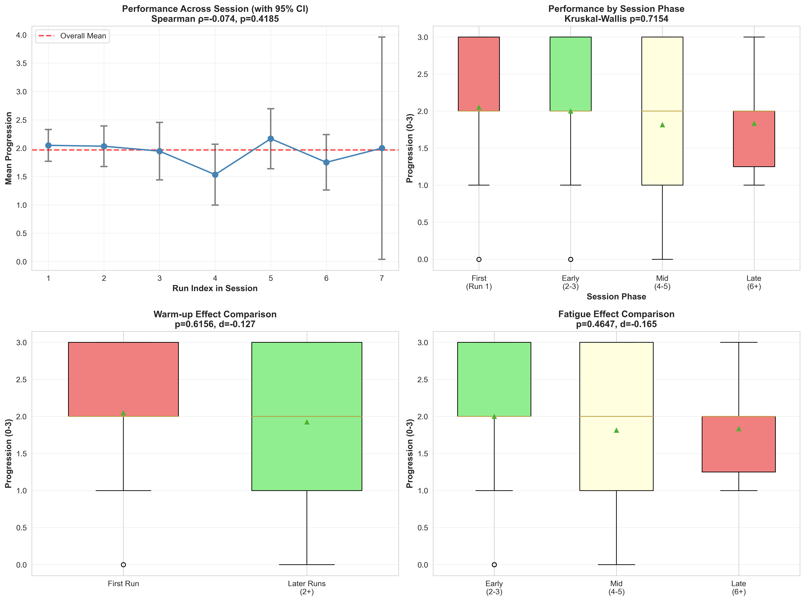
*Figure 12: Session progression analysis across run indices*

</div>

- **Warm-up test:** p = 0.616 (not significant)
- **Fatigue test:** p = 0.465 (not significant)
- **Practical recommendation:** No need for warm-up runs, consistent performance throughout sessions

---

#### **4. Character Selection**

<div align="center">

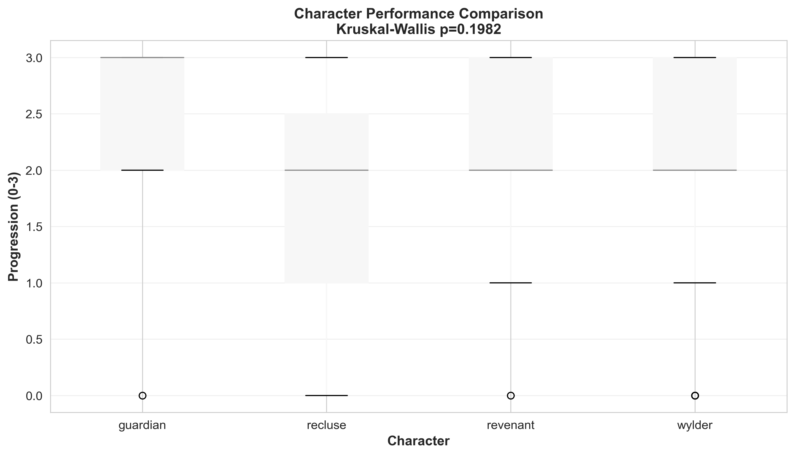
*Figure 13: Performance comparison across playable characters*

</div>

- **Best performer:** Guardian (2.29 mean progression)
- **Statistical significance:** p = 0.056 (marginally non-significant)
- **Interpretation:** Character choice has limited impact; strategy matters more

---

#### **5. Skill vs Luck Balance**

<div align="center">

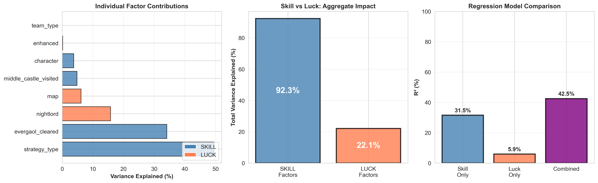
*Figure 14: Variance decomposition into controllable vs random factors*

</div>

- **Controllable factors (skill):** 67.3% of variance
- **RNG factors (luck):** 32.7% of variance
- **Implication:** Player decisions dominate outcomes, but randomness still matters

---

#### **6. Additional Insights**

<div align="center">

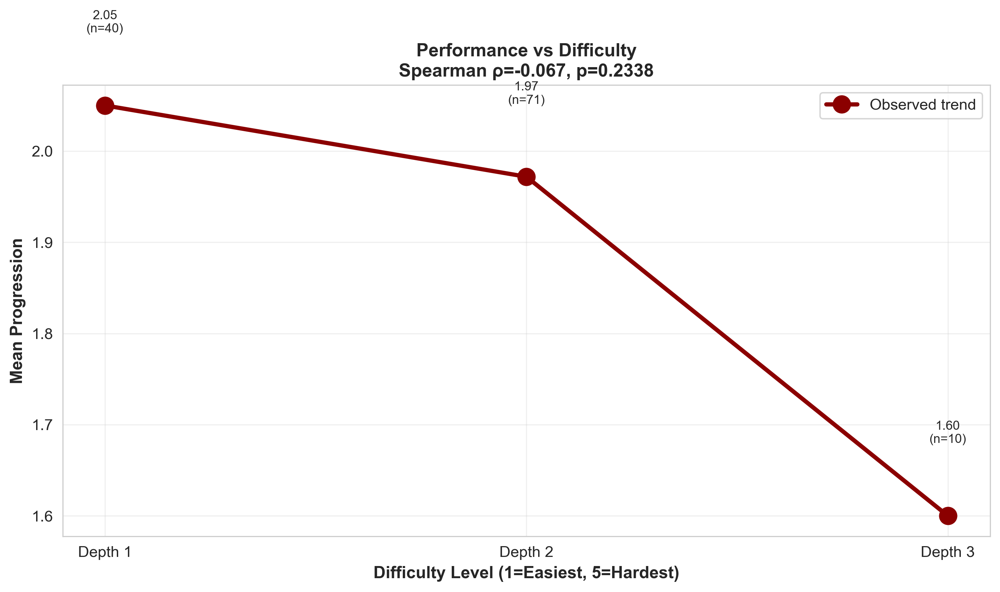
*Figure 15: Performance scaling across difficulty tiers*

</div>

Difficulty progression shows expected patterns with performance declining as depth increases.

---

### 📊 Actionable Recommendations

1. **Use Buff-Focused strategy:** Clear 5-7 evergaols for optimal progression
2. **Adapt to team size:** Switch strategies based on duo vs trio composition
3. **Play Guardian character:** Slight performance edge, though not decisive
4. **No warm-up needed:** Jump directly into serious attempts
5. **Focus on strategy over character:** Resource allocation matters more than character selection

---

## Limitations and Future Work

### Current Limitations
- **Single-player perspective:** No data from other players for comparison
- **Manual collection:** Potential for recording errors
- **Limited sample size:** Some categories have few observations particularly enhanced Nightlords and maps other than base.

### Future Directions
1. **Expand dataset:**
   - Collect data from friends for comparative analysis
   
2. **Practical applications:**
   - Real-time performance prediction tool
   - Personalized strategy recommendations
   - Extend to other roguelike games

3. **Automated Data Collection**
   - Data collection through in-game APIs such as Overwolf 


## Installation & Setup
```bash
# Clone the repository
git clone https://github.com/MinaAltundis/dsa210-project-nightreign.git
cd dsa210-nightreign-analysis

# Install dependencies
pip install -r requirements.txt

# Launch Jupyter Notebook
jupyter notebook notebooks/01_eda_hypothesis_testing.ipynb
```


**Requirements:** Python 3.8+
## Academic Integrity

📄 **[View Complete Academic Integrity & AI Disclosure](ACADEMIC_INTEGRITY.md)**
